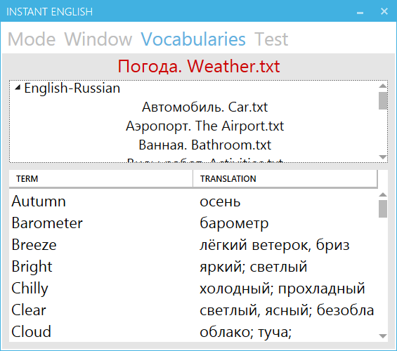

# Welcome to Instant English!
Instant English is the further development of the idea of learning foreign (or unknown) words during another work on PC. 
The foreign word and its translation are located inside window. 
The user controls window's position and sets delay time of the current pair foreign word/translation. 

# Features
- Appearance, pop up and static work modes
- Configurable window
  - Sizes, background color
  - Font properties
- Configurable time properties
  - Time interval between appearances (for appearance and pop up modes)
  - Current foreign word/translation delay time
- User vocabulary checking for showing unknown words

# GUI
[MahApps.Metro](https://github.com/MahApps/MahApps.Metro)

# Screen shots

